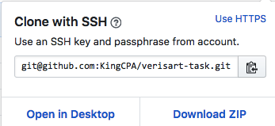

This Project is being created for Verisart for a Task project.

**Steps to be able to run the app**

repository name = **verisart-task**

head to the GitHub address of **verisart-task** and clone or download.

On GitHub, navigate to your clone of the **verisart-task** repository.

Under the repository name, click Clone.

**Clone with SSH section** 

1. to copy the clone URL for the repository. 

2. Open Terminal.

3. Type *git clone* and then paste the URL you copied in Step 1. It will look like this, with your GitHub username instead of YOUR-USERNAME:
git clone git@github.com:/YOUR-USERNAME/verisart-task.git

4. Press Enter. Your local clone will be created.
5. will look like this is the terminal

Now, you have a local copy of your clone of the **verisart-task** repository!

Now you have cloned repository you will need to install NPM to run this locally.

1. open terminal
2.  install NPM using the command *npm install* (https://www.npmjs.com/get-npm)
3. once you have this installed you can then look to start the server with the command *npm start*

**Areas to consider in relation to the Rest API request;**

1. Using Mobx (http://mobx.js.org) could be considered a good move for the state management due to its flexibility for state management.
2. Using Mobx is less opinionated and with minimal boilerplating
3. Mobx is cross functional for OOP and Functional Programming.

Another area to consider is the encryption of data while transporting from backend/ database, you can use a NPM project called Bcrypt (https://github.com/kelektiv/node.bcrypt.js#readme).

Bcrypt put simply takes a string (passwords) and converts it to a hash value, allows for greater security for information being stored on the database.

**Mock API**

I considered two options for a mock API first would have been setting up a NodeJS back end and created end points that would relate to the login page.

The second option I had was to use a JSON server (https://github.com/typicode/json-server\) this would have been an easy set up and straight forward to configure.

Other Information:

With this project I used flex-box as a CSS style, a though for the future would be to consider the use grid box for CSS functionality.